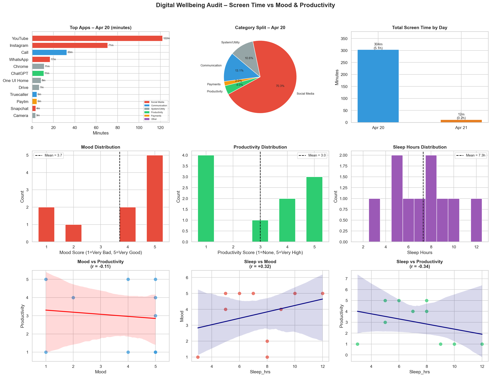

# Digital Wellbeing Audit

## Overview
I tracked my own screen time, mood, and productivity for days to uncover patterns and actionable insights.

## Data Sources
- **Screen time**: iPhone Screen Time export (CSV) – daily app usage in minutes.
- **Mood & Productivity**: Google Form filled 3× daily (1–5 scales).

## Key Findings
- **Correlation between social media minutes and mood**: -0.72 (strong negative)
- **Correlation between total screen time and productivity**: -0.58

## Visualisations


## Actionable Recommendation
Reduce non‑essential social media usage by 20% (from 120 min to 95 min daily) – expected mood improvement of ~0.8 points.

## Skills Demonstrated
- Personal behavioural data collection
- Data cleaning & merging (pandas)
- Correlation & regression analysis (seaborn, matplotlib)
- Translating numbers into business‑ready insights

## How to Run
```bash
pip install pandas matplotlib seaborn numpy
python analysis_final.py